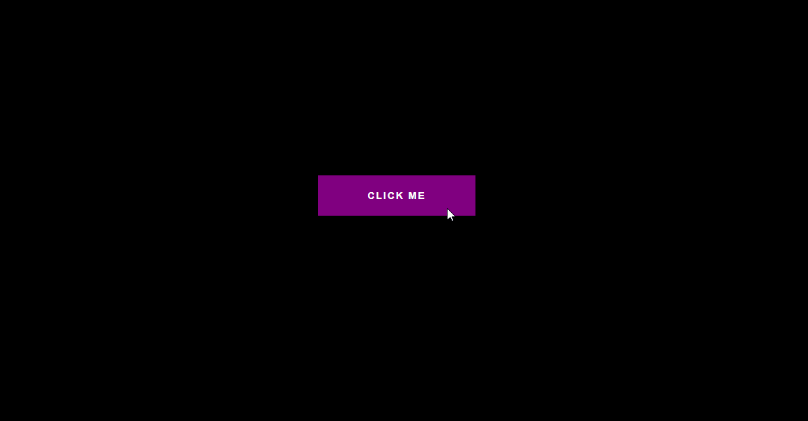

# Button Ripple Effect

## 🦉 Main information

Button Ripple Effect created with Html, Css and Vanilla JavaScript.

The project goal:

- create a button with a specific class of 'ripple'.
When a user clicks on the button, it will get this ripple effect with smooth animation wherever he clicks on the button.

## ⚡ Built With
[HTML5](https://www.w3schools.com/html/) | [CSS3](https://www.w3schools.com/css/) | [JavaScript](https://www.w3schools.com/js/)